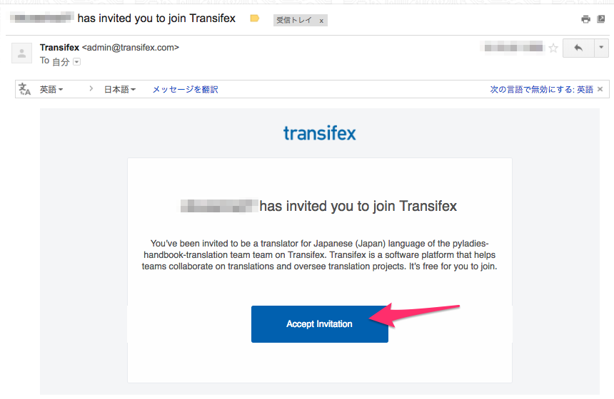
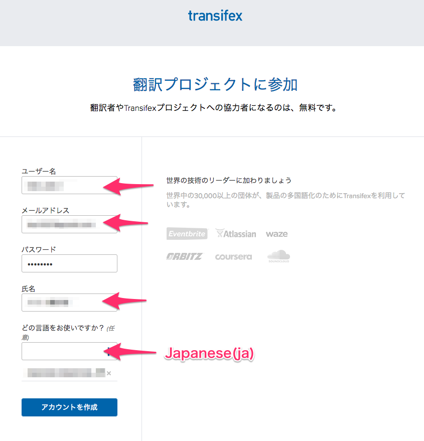
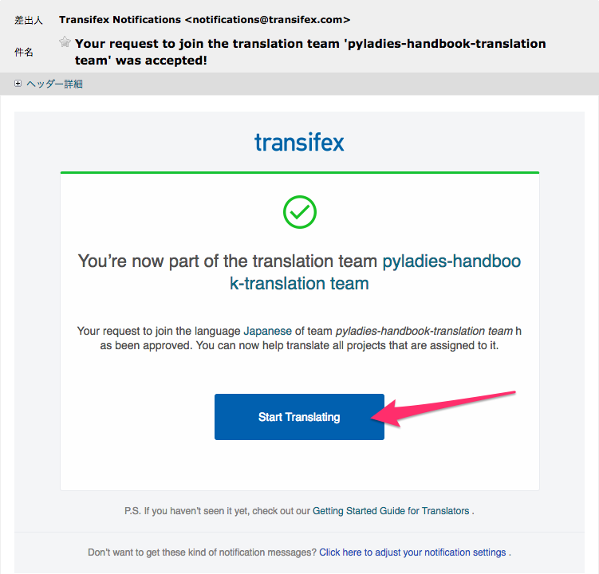
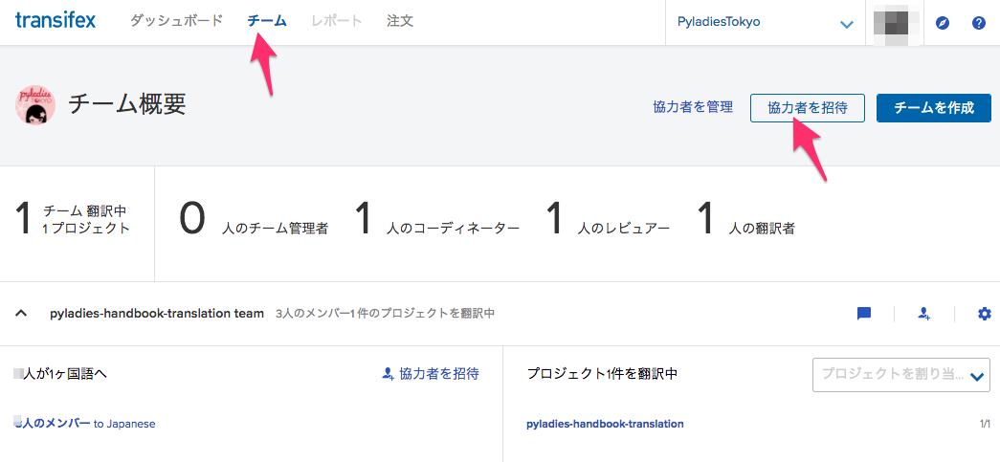
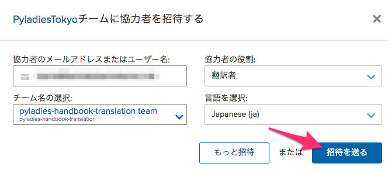
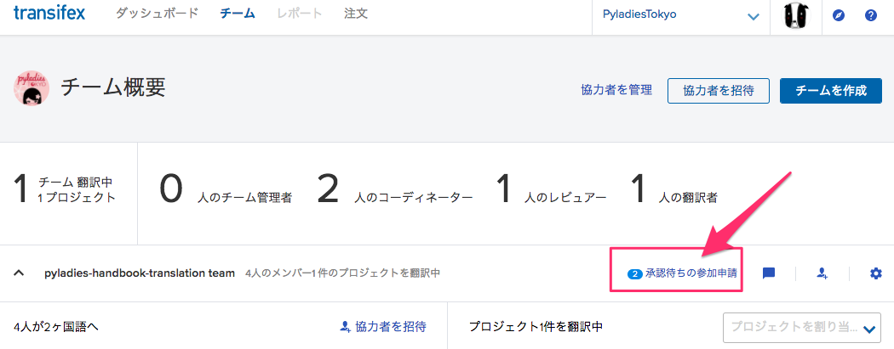
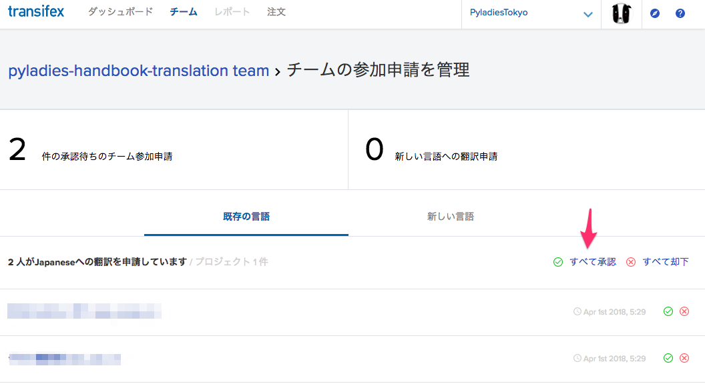

# pyladies-handbook-translation

PyLadiesには、[PyLadies Organizer Handbook](http://kit.pyladies.com/) というハンドブックがあります。
このハンドブックの翻訳プロジェクトです。

## 目的
- [PyLadies Organizer Handbook](http://kit.pyladies.com/)の日本語化
- 本家と同様に `pip` コマンドでインストールできるようにする
- 本家ハンドブックに `/ja` として取り込んでもらう

## 方法
翻訳には、`docs.python.org` でも利用されている [transifex](https://www.transifex.com/) を利用します。

## 翻訳者になるには
[PyLadies Japan Slack](https://pyladies-japan.slack.com/) の `#handbook-translation` 部屋で翻訳者に立候補してください。管理者が招待します。

翻訳とレビューができるユーザーとして招待します。

不明なことは `#handbook-translation` 部屋で確認してください。

## アカウントの登録
管理者から [transifex](https://www.transifex.com/) への招待メールが来ます。

メールのタイトルは「[管理者名] has invited you to join Transifex」です。「Accept Invitation」ボタンをクリックします。

翻訳プロジェクト参加画面が表示されますので、ユーザー名、メールアドレス、パスワード、氏名（表示名）、言語「Japanese(ja)」を選択し、「アカウントを作成」をクリックします。

- ここまでできたら、管理者が「承認」を行うまで待ちます。

- `Your request to join the translation team 'pyladies-handbook-translation team' was accepted!` というタイトルのメールが来たら、「Start Translating」をクリックします。

これで、翻訳に参加できます。

## 翻訳する

「ダッシュボード」を選択し、「翻訳」ボタンをクリックします。

言語「Japanese(ja)」を選択します。

「未翻訳」が存在する行を選びます。

翻訳する行を選びます。右側に翻訳文を入力します。気になることがあったら、「コメント」を書いてください。

## レビューする
慣れてきたら、他の人の翻訳をレビューしましょう。

ダッシュボードから、翻訳一覧に移動し、「レビュー待ちの文字列」が存在する行を選びます。

左上の「レビュー待ち」の数字をクリックすると、レビュー待ちの一覧が表示されます。
内容を確認し、直に修正するか、コメントを付けましょう。
レビューが終了したら、コメントに **LGTM（Looks Good To Me）** と書いてください。コードレビューなどで使われる自分的にはOKという意味です。
レビューボタンは押さないでください。

## 【管理者向け】翻訳者の追加方法

- Slackで依頼を貰ったら、[transifex](https://www.transifex.com/)にログインします。
- ヘッダーの「チーム」を選択します。
- 「協力者を招待」ボタンをクリックします。

- 協力者のメールアドレス、協力者の役割「翻訳者」、チーム名の選択「pyladies-handbook-translation team」、言語を選択「Japanese(ja)」を選択
- 「招待を送る」をクリックします。

翻訳者がアカウントを登録すると、チーム概要画面に「承認待ちの参加申請」リンクが出るのでクリックします。

承認します。

## 決まり

- 1つの訳に2つの **LGTM** がついたら、レビューボタンを押して、完了とします。
