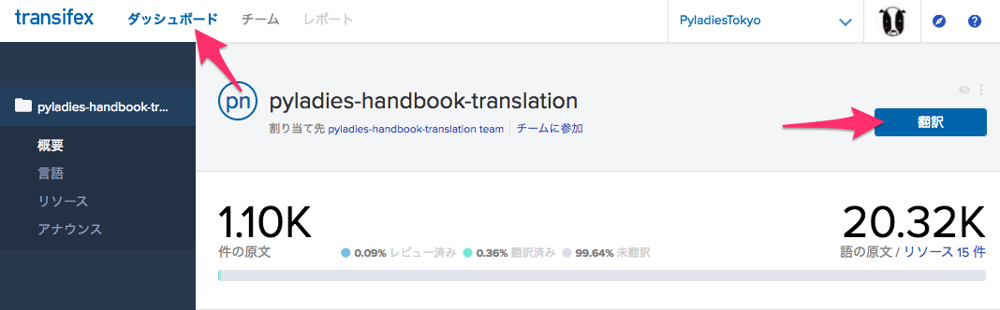
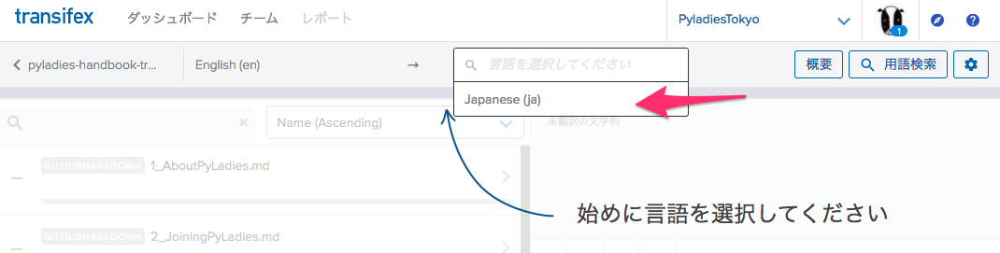
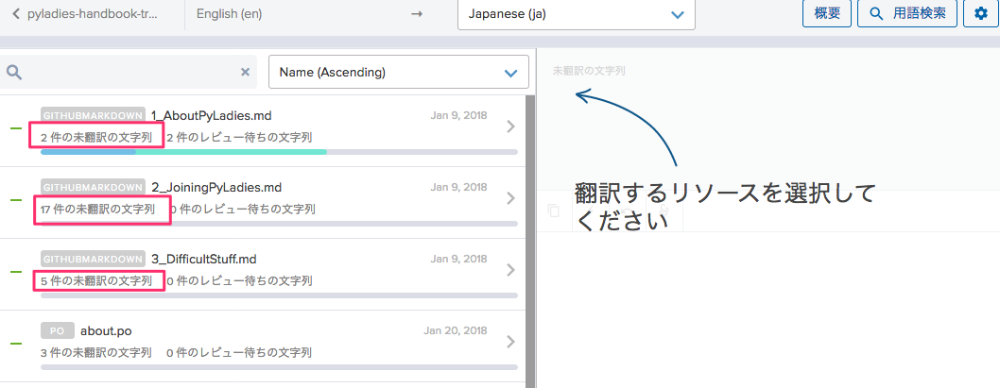
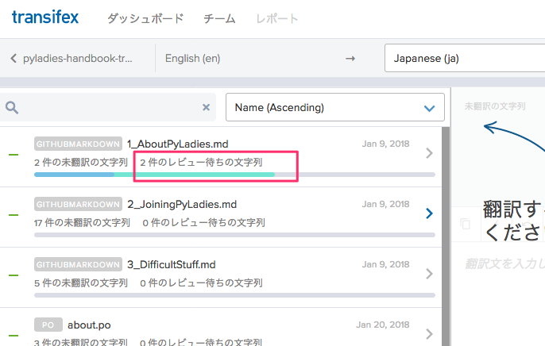
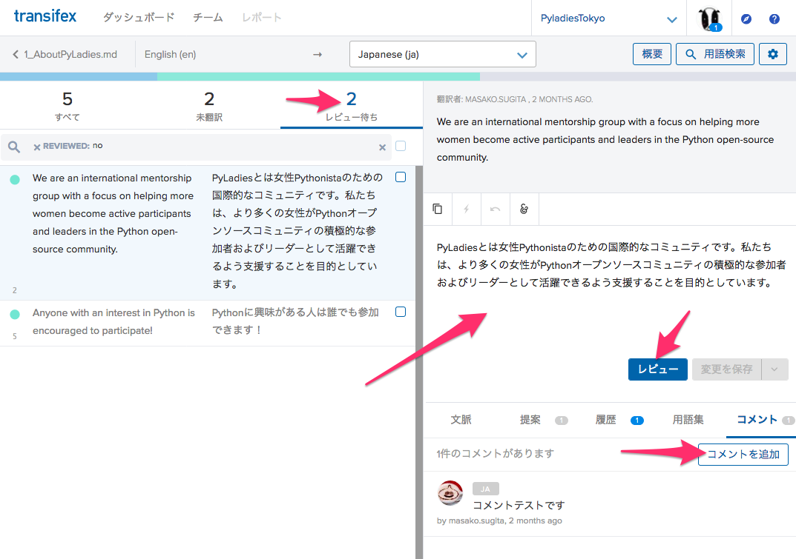

# 翻訳とレビュー

## 翻訳する

「ダッシュボード」を選択し、「翻訳」ボタンをクリックします。

言語「Japanese(ja)」を選択します。

「未翻訳」が存在する行を選びます。

翻訳する行を選びます。右側に翻訳文を入力します。気になることがあったら、「コメント」を書いてください。

## レビューする
慣れてきたら、他の人の翻訳をレビューしましょう。

ダッシュボードから、翻訳一覧に移動し、「レビュー待ちの文字列」が存在する行を選びます。

左上の「レビュー待ち」の数字をクリックすると、レビュー待ちの一覧が表示されます。
内容を確認し、直に修正するか、コメントを付けましょう。
レビューが終了したら、コメントに **LGTM（Looks Good To Me）** と書いてください。コードレビューなどで使われる自分的にはOKという意味です。
レビューボタンは押さないでください。

## 決まり

- 1つの訳に2つの **LGTM** または **OK** がついたら、レビューボタンを押して、完了とします。
